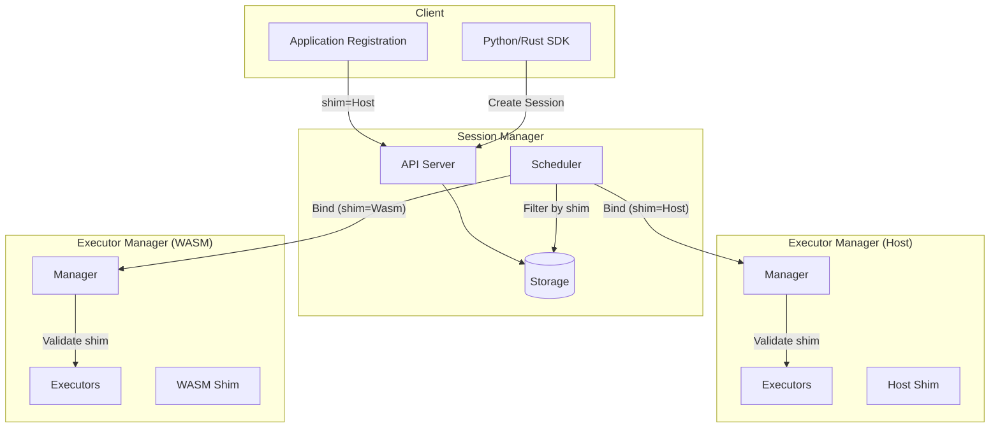
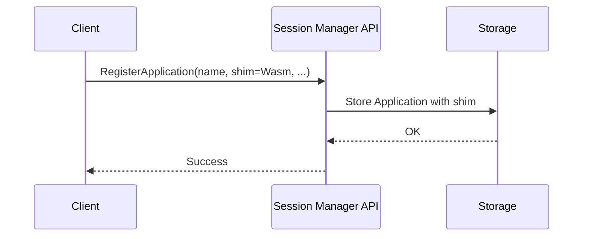
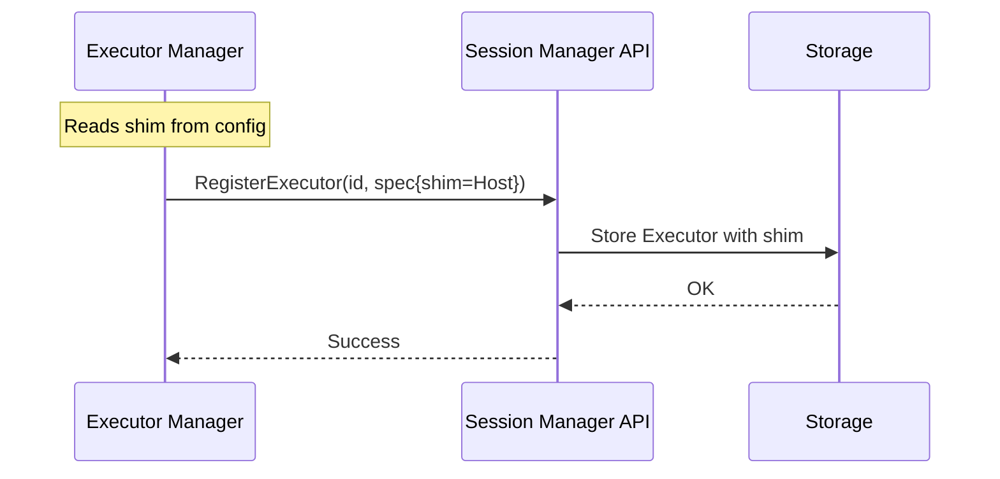
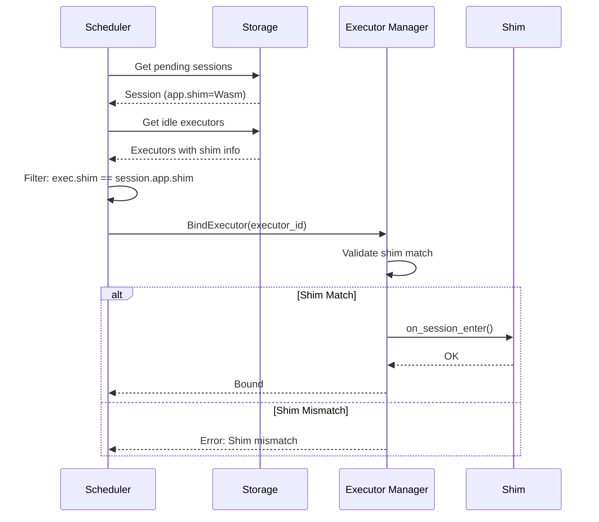

# Design Document: Shim Selection in Application

## 1. Motivation

**Background:**

Currently, the shim type (Host vs WASM) is configured at the executor-manager level via `flame-cluster.yaml`. While this works for homogeneous deployments where all applications use the same runtime, it creates challenges in heterogeneous environments where different applications require different execution runtimes.

The `ApplicationSpec` previously had a `shim` field that was deprecated and removed in favor of executor-level configuration. However, this approach has limitations:

1. **No Application-Level Control:** Applications cannot declare their runtime requirements.
2. **Scheduling Blindness:** The session manager cannot make informed decisions about which executors can run which applications.
3. **Silent Failures:** If an application requiring WASM is scheduled on a Host executor (or vice versa), the failure mode is unclear.

**Target:**

Enable applications to specify their required shim type, and ensure the system respects this requirement throughout the scheduling and execution lifecycle:

1. Applications can declare their required shim (Host or WASM).
2. Session Manager creates executors only when shim requirements can be satisfied.
3. Session binding validates shim compatibility.
4. Executor Manager raises clear errors on shim mismatch.

## 2. Function Specification

**Configuration:**

| Component | Configuration | Description |
|-----------|--------------|-------------|
| Application | `shim` field in ApplicationSpec | Declares required runtime (Host/WASM) |
| Executor Manager | `executors.shim` in flame-cluster.yaml | Declares supported runtime (unchanged) |

**Default Values:**
- Application shim: `Host` (backward compatible)
- Executor shim: `Host` (unchanged)

**API:**

### ApplicationSpec Changes (types.proto)

```protobuf
message ApplicationSpec {
  Shim shim = 1;  // Re-introduce: Required shim type (Host or WASM)
  optional string description = 2;
  // ... rest unchanged
}
```

### ExecutorSpec Changes (types.proto)

```protobuf
message ExecutorSpec {
  string node = 1;
  ResourceRequirement resreq = 2;
  // Field number 3 (slots) reserved — removed in the slots-cleanup refactor; do not reuse.
  reserved 3;
  reserved "slots";
  Shim shim = 4;  // NEW: Supported shim type reported by executor
}
```

**CLI:**

No CLI changes required. The `flmctl` commands for application management will automatically support the `shim` field.

**Scope:**

- **In Scope:**
  - Re-introduce `shim` field in `ApplicationSpec`
  - Add `shim` field to `ExecutorSpec` for executor capability reporting
  - Session Manager: Filter executors by shim compatibility during scheduling
  - Executor Manager: Validate shim match during binding
  - Clear error messages on shim mismatch

- **Out of Scope:**
  - Dynamic shim switching (changing executor shim without restart)
  - Supporting multiple shims in one executor-manager process
  - Shim-aware node affinity or anti-affinity rules
  - Automatic executor provisioning based on shim demand

- **Limitations:**
  - Each executor-manager instance supports exactly one shim type
  - No automatic scaling of executors based on shim requirements
  - Applications must explicitly specify shim; no auto-detection

**Feature Interaction:**

- **Related Features:**
  - Scheduler: Must filter executors by shim compatibility
  - Executor lifecycle: Registration must include shim capability
  - Application management: Must store and propagate shim requirement

- **Updates Required:**
  - `common/src/apis.rs`: Add `shim` to `Application`, `ApplicationAttributes`, `ApplicationContext`
  - `rpc/protos/types.proto`: Add `shim` to `ApplicationSpec` and `ExecutorSpec`
  - Session Manager scheduler: Add shim filtering logic
  - Executor Manager: Add shim validation in binding

- **Compatibility:**
  - Backward compatible: Default shim is `Host`
  - Old executors (without shim field) treated as `Host`
  - Old applications (without shim field) treated as `Host`

## 3. Implementation Detail

**Architecture:**



**Components:**

| Component | Responsibility |
|-----------|---------------|
| `common/apis.rs` | Data structures with shim field |
| `rpc/types.proto` | Protocol definitions with shim |
| `session_manager/scheduler` | Filter executors by shim compatibility |
| `session_manager/controller` | Propagate shim in binding requests |
| `executor_manager/states/idle.rs` | Validate shim match before binding |

**Sequence: Application Registration**



**Sequence: Executor Registration**



**Sequence: Session Binding with Shim Validation**




**Data Structures:**

### Application (common/src/apis.rs)

```rust
#[derive(Clone, Debug, Default)]
pub struct Application {
    pub name: String,
    pub version: u32,
    pub state: ApplicationState,
    pub creation_time: DateTime<Utc>,
    pub shim: Shim,  // NEW: Required shim type
    pub image: Option<String>,
    // ... rest unchanged
}

#[derive(Clone, Debug)]
pub struct ApplicationAttributes {
    pub shim: Shim,  // NEW: Required shim type
    pub image: Option<String>,
    // ... rest unchanged
}

#[derive(Clone, Debug)]
pub struct ApplicationContext {
    pub name: String,
    pub shim: Shim,  // NEW: Required shim type
    pub image: Option<String>,
    // ... rest unchanged
}
```

### Executor (common/src/apis.rs or model)

The executor already has access to shim via `FlameClusterContext`. For RPC, we add:

```rust
// In executor_manager, when registering:
let spec = ExecutorSpec {
    node: node_name,
    resreq: resource_requirement,
    shim: self.context.executors.shim,  // NEW
};
```

**Algorithms:**

### Shim Filtering in Scheduler

Location: `session_manager/src/scheduler/actions/allocate.rs` (or similar)

```rust
// Pseudocode for executor filtering
fn filter_executors_by_shim(
    session: &Session,
    executors: Vec<Executor>,
    applications: &HashMap<String, Application>,
) -> Vec<Executor> {
    let app = applications.get(&session.application)?;
    let required_shim = app.shim;
    
    executors.into_iter()
        .filter(|exec| exec.shim == required_shim)
        .collect()
}
```

### Shim Validation in Executor Manager

Location: `executor_manager/src/states/idle.rs`

```rust
// In IdleState::execute(), after receiving session context
async fn execute(&mut self) -> Result<Executor, FlameError> {
    let ssn = self.client.bind_executor(&self.executor).await?;
    
    let Some(ssn) = ssn else {
        // No session, release
        return Ok(self.executor.clone());
    };
    
    // NEW: Validate shim compatibility
    let executor_shim = self.executor.context
        .as_ref()
        .map(|ctx| ctx.executors.shim)
        .unwrap_or(Shim::Host);
    
    let app_shim = ssn.application.shim;
    
    if executor_shim != app_shim {
        tracing::error!(
            "Shim mismatch: executor supports {:?}, application requires {:?}",
            executor_shim, app_shim
        );
        return Err(FlameError::InvalidConfig(format!(
            "Shim mismatch: executor supports {:?}, application requires {:?}",
            executor_shim, app_shim
        )));
    }
    
    // Continue with binding...
}
```

**System Considerations:**

- **Performance:** Shim filtering adds O(n) overhead to scheduling where n = number of executors. Negligible for typical cluster sizes.
- **Scalability:** No impact on horizontal scaling. Each executor-manager instance is independent.
- **Reliability:** Shim mismatch errors are explicit and logged. No silent failures.
- **Security:** No security implications. Shim is a runtime configuration, not a security boundary.
- **Observability:** 
  - Log shim mismatch errors at ERROR level
  - Include shim in executor registration logs
  - Consider adding metrics: `flame_executor_shim{type="host|wasm"}`

**Dependencies:**

- No new external dependencies
- Internal: `common`, `rpc`, `session_manager`, `executor_manager`

## 4. Use Cases

**Basic Use Cases:**

### UC1: Host Application (Default)

**Description:** An application uses the default Host shim for native process execution.

**Workflow:**
1. User registers application without specifying shim (defaults to Host)
2. User creates session for the application
3. Scheduler finds idle executors with `shim=Host`
4. Session is bound to a Host executor
5. Tasks execute via Host shim (subprocess)

**Expected Outcome:** Application runs successfully on Host executor.

### UC2: WASM Application

**Description:** An application requires the WASM shim for sandboxed execution.

**Workflow:**
1. User registers application with `shim=Wasm`
2. User creates session for the application
3. Scheduler finds idle executors with `shim=Wasm`
4. Session is bound to a WASM executor
5. Tasks execute via WASM shim

**Expected Outcome:** Application runs successfully on WASM executor.

### UC3: Shim Mismatch Prevention

**Description:** System prevents binding when shim requirements don't match.

**Workflow:**
1. User registers application with `shim=Wasm`
2. User creates session
3. Scheduler looks for executors with `shim=Wasm`
4. No WASM executors available (only Host executors)
5. Session remains pending (no binding occurs)

**Expected Outcome:** Session stays in pending state. Clear indication that no compatible executors are available.

**Advanced Use Cases:**

### UC4: Mixed Cluster

**Description:** Cluster has both Host and WASM executor-managers.

**Workflow:**
1. Deploy executor-manager-1 with `shim=Host`
2. Deploy executor-manager-2 with `shim=Wasm`
3. Register app-a with `shim=Host`
4. Register app-b with `shim=Wasm`
5. Create sessions for both apps
6. Scheduler routes app-a sessions to executor-manager-1
7. Scheduler routes app-b sessions to executor-manager-2

**Expected Outcome:** Each application runs on the appropriate executor type.

### UC5: Executor Manager Restart with Different Shim

**Description:** Executor manager is restarted with a different shim configuration.

**Workflow:**
1. Executor-manager running with `shim=Host`
2. Executors registered with `shim=Host`
3. Executor-manager stopped
4. Executor-manager restarted with `shim=Wasm`
5. New executors registered with `shim=Wasm`

**Expected Outcome:** New executors correctly report `shim=Wasm`. Old sessions bound to old executors continue (if executors still exist) or fail gracefully.

## 5. References

**Related Documents:**
- [RFE368-shim-config](../RFE368-shim-config/): Previous shim configuration design
- [AGENTS.md](../../AGENTS.md): Project structure and conventions

**External References:**
- [WebAssembly System Interface (WASI)](https://wasi.dev/): WASM runtime standard
- [Flame Architecture](../../README.md): Overall system architecture

**Implementation References:**
- `executor_manager/src/shims/mod.rs`: Shim abstraction and factory
- `executor_manager/src/shims/host_shim.rs`: Host shim implementation
- `executor_manager/src/shims/wasm_shim.rs`: WASM shim implementation
- `common/src/ctx.rs`: FlameClusterContext with shim configuration
- `session_manager/src/scheduler/`: Scheduling logic
