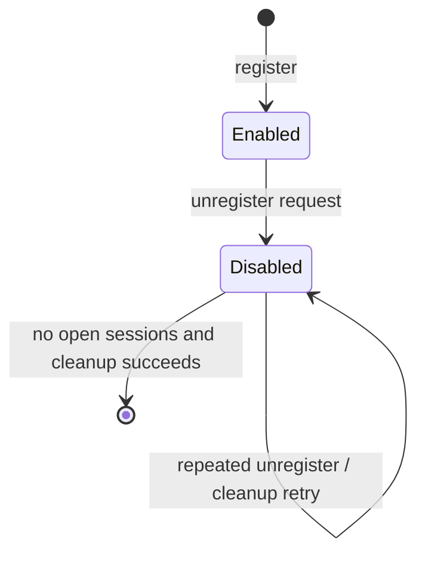
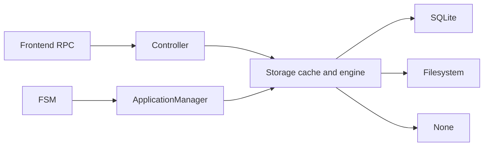

# Design: Reconciled Application and Session Lifecycle

## 1. Motivation

### Background

`Controller::unregister_application` currently removes an application
synchronously. Session creation and opening are independent controller calls,
so an unregister can race with admission of a new session. SQLite and
filesystem have backend checks for open sessions, but those checks do not form
one controller lifecycle boundary and `none` has no equivalent protection.

Rejecting unregister while sessions are open would avoid the race, but would
make callers repeatedly coordinate teardown themselves. Instead, unregister
should express durable deletion intent: stop admitting sessions immediately,
allow existing sessions to drain, and let an FSM-owned application manager
finish cleanup.

`Application` already has a persisted `state`, with `Enabled` and `Disabled`
values. `Disabled` is not currently assigned by an API, so this design uses it
as the terminal pending-removal state. No new enum value or database migration
is required.

### Goals

1. Make unregister a durable, idempotent `Enabled -> Disabled` transition.
2. Reject new session admission as soon as the disabled state is committed.
3. Keep a disabled application while any of its sessions remain open.
4. Remove the application metadata after all sessions close.
5. Resume incomplete cleanup after process restart.
6. Give SQLite, filesystem, and `none` the same controller-visible behavior.
7. Keep session admission lock-free: create/open check application state and
   then use the existing storage operations.
8. Start one `ApplicationManager` with the FSM to reconcile disabled
   applications only.

### Non-goals

- No distributed lock across multiple session-manager processes.
- No executor-node installed-package garbage collection.
- No application-package deletion. Flame Object Cache owns both its persistent
  and in-memory data and will perform application-aware garbage collection in
  follow-up issue #540 through a Flame metadata server.
- No cache URL or protocol changes; existing gRPC/Arrow Flight URLs remain
  unchanged.
- No re-enable transition. `Disabled` is terminal in this lifecycle.

## 2. Function Specification

### State machine



`Disabled` means deletion has been accepted and is pending reconciliation. It
is not a reversible administrative pause.

| Operation | Enabled | Disabled | Absent |
| --- | --- | --- | --- |
| register | `AlreadyExist` | `AlreadyExist` | create `Enabled` |
| update | allowed under existing rules | `InvalidState` | `NotFound` |
| unregister | persist `Disabled`; succeed | idempotent | `NotFound` |
| create session | allowed | `InvalidState` | `NotFound` |
| open session | allowed | `InvalidState` | `NotFound` |
| close/delete/get/list | allowed | allowed | existing session semantics |
| cleanup reconciliation | no-op | drain or remove | no-op |

Existing sessions and tasks continue running after the application becomes
disabled. Their close/delete operations remain available so the application
can drain. A new `open_session` call is rejected after disable, including an
attempt to reopen an already-existing session; a handle that was admitted
before the state transition may continue using and closing that session.

Excluding the accepted request race described below, `Disabled` admits no new
session: both create and open/open-or-create return `InvalidState`. The
FSM-owned manager retains the disabled application until every session whose
state is `Open` has closed.

### Unregister contract

`unregister_application(name)` no longer means that the application is absent
when the RPC returns. Success means:

1. the application exists;
2. its `Disabled` state is durably stored and reflected in cache; and
3. no later create/open admission can pass the enabled-state check.

The application remains visible through get/list APIs as `Disabled` until the
manager removes it. If it has no open sessions, cleanup may finish before a
following get/list call observes the disabled state. Repeating unregister while
it is still disabled succeeds; the next manager pass observes it. After
physical removal, unregister returns `NotFound`.

### Session admission contract

Both `create_session` and `open_session` resolve their owning application and
require its current state to be `Enabled`. The controller does not acquire a
lifecycle lock. Storage must not satisfy `open_session` solely from its session
cache, because a cached session must still pass the application's current
state check.

The state check and session operation are intentionally not atomic. A request
that reads `Enabled` may finish creating or opening a session while unregister
is changing the application to `Disabled`. Flame's existing delay-release
window provides time for that in-flight session to become visible to the
manager before resources are reclaimed, so this residual race is accepted for
this change. This in-flight request is the only exception: every request that
observes `Disabled` returns `InvalidState`.

This design does not add controller locks, `admit_*_session` APIs, or a new
cross-backend transaction spanning application state and session creation.

### Package ownership

FSM does not delete application packages. Flame Object Cache owns its
persistent storage and in-memory cache and therefore owns removal from both
tiers. Follow-up issue #540 will introduce a Flame metadata server that lets
FOC reconcile application-scoped objects asynchronously without adding cache
I/O to FSM request paths.

Until that work lands, removing application metadata may leave its package in
FOC. Existing gRPC/Arrow Flight cache URL behavior remains unchanged.

## 3. Implementation Detail

### Architecture



The responsibilities are separated as follows:

- `Controller` exposes lifecycle operations and performs state-based admission.
- `Storage` persists state and keeps its cache consistent.
- `ApplicationManager` scans disabled applications and retries terminal
  metadata cleanup.

### Application state persistence

Add a narrow engine operation:

```rust
async fn update_application_state(
    &self,
    name: ApplicationID,
    state: ApplicationState,
) -> Result<Application, FlameError>;
```

`Storage` delegates to the engine and then updates its cached `Application`.
This operation does not use the existing attribute update path and does not
reject the transition merely because sessions are open.
It remains an internal storage/controller API; unregister is its only caller.

- SQLite updates `state` and increments `version` in one transaction.
- Filesystem updates application metadata under its application lock.
- `none` updates its application map under its mutex.

Updating to the already-stored state returns the current application without
incrementing its version. A failed durable update leaves the cached application
unchanged and causes unregister to fail.

The existing `Enabled = 0` and `Disabled = 1` wire values remain unchanged.
All registration paths continue to initialize applications as `Enabled`, and
ordinary application update preserves the current state. Apart from that
initialization, public unregister is the only operation that changes
`Application.state`; the manager never changes it and only physically deletes
disabled metadata.

Rename the storage/engine operation that physically removes metadata from
`unregister_application` to
`delete_application`. It is an internal
manager primitive, not the public unregister transition. Each backend checks
the stored application state and current open-session count before removal. A
direct delete of an enabled or non-drained application fails with
`InvalidState`. This final check uses each backend's existing synchronization;
it does not introduce an atomic session-admission protocol.

### Storage lifecycle queries

Enhance the existing application-list path with an optional state filter:

```protobuf
message ListApplicationsRequest {
  optional ApplicationState state = 1;
}
```

Add an optional `state` field to `ApplicationFilter`. The filter
flows through `Controller::list_applications`, `Storage::list_applications`, and
`Engine::find_applications`. `None` preserves the current list-all behavior, so
existing clients remain compatible. The manager passes an
`ApplicationFilter` whose state is `Disabled`.

The frontend converts the optional request enum to `ApplicationState` and
rejects an unknown value with `InvalidArgument`. Existing SDK calls continue to
send an empty request and therefore list all applications; no caller migration
is required.

Extend the existing `SessionFilter` with an optional owning application while
retaining its state, IDs, and in-memory predicate fields. The list-session RPC
exposes the application and state subset:

```protobuf
message ListSessionsRequest {
  optional string application = 1;
  optional SessionState state = 2;
}
```

Keep the other narrow storage queries used by the controller and manager:

- `session_application(id)` resolves a cached or persisted session's owning
  application for `open_session(id, None)`.
- `list_sessions(filter)` returns sessions matching a `SessionFilter`.
- `SessionFilter.limit` bounds existence queries; the manager requests at most
  one application-plus-`Open` session.
- `Engine::find_sessions()` loads persisted sessions during startup recovery.
- `delete_application(application)` performs
  the final state/session check and deletes only application metadata.

`session_application` falls back to `Engine::get_session` so an evicted
persisted session retains its current error behavior. These methods report
lifecycle facts; they do not add a session-admission transaction.

SQLite applies `WHERE state = ?` when the filter is present and returns the
matching rows as a `Vec<Application>`; without a filter it retains the current
query. Filesystem and `none` apply the same optional filter to their in-memory
metadata.

### Controller operations

#### Register and update

Register and update require the latest state to be `Enabled`; update cannot
mutate or re-enable a pending deletion. A registration with the same disabled
name remains `AlreadyExist` until final cleanup removes the tombstone.

#### Unregister

1. Atomically transition `Enabled` to `Disabled` through
   `update_application_state(name, ApplicationState::Disabled)`.
2. If already `Disabled`, treat the request as successful.
3. Return without deleting the application, sessions, executors, or package.

The durable state transition is the unregister linearization point.

#### Create session

1. Read `attributes.application`.
2. Require its current state to be `Enabled`.
3. Call the existing `Storage::create_session` operation.

No controller lifecycle lock is held across the storage call.

#### Open session

For `Some(attributes)`, use `attributes.application`. For `None`, resolve the
cached or persisted session's owning application through
`session_application`. Require that application to be `Enabled`, then call the
existing `Storage::open_session` operation.

The persistence lookup preserves `InvalidState` for a closed, evicted session
instead of changing it to `NotFound`. A missing session opened with attributes
uses the existing open-or-create behavior after the same state check.

#### Close session

Storage persists the closed state before updating the cache. The application
manager observes the closed state on its next periodic pass.

### Application manager

Add an `ApplicationManager` in `session_manager/src/applications.rs` (split to
`applications/manager.rs` if the module becomes too large). It follows the
existing `FlameThread` runner pattern and owns:

```rust
const APPLICATION_MANAGER_INTERVAL: Duration = Duration::from_secs(1);

struct ApplicationManager {
    controller: ControllerPtr,
    storage: StoragePtr,
}
```

The manager is owned by the FSM; the controller does not own or notify it.

FSM startup performs these steps in order:

1. Create storage and run `storage.load_data()`.
2. Create the controller and construct `ApplicationManager`.
3. Run `manager.reconcile_once()` before configured-application reconciliation
   or starting the frontend, backend, or scheduler, so persisted disabled
   applications resume cleanup deterministically.
4. Run the existing one-shot configured-application startup reconciliation.
5. Add `manager.run(ctx)` to the FSM handler set alongside the other long-lived
   runners.

The current configured-application registration/update logic remains a separate
startup concern and is not moved into the manager. After the initial pass,
`run` waits one second, then invokes another pass. The fixed interval is
intentionally not tied to the scheduler's 100 ms default and adds no new
configuration. The manager runs in the FSM handler set rather than as a
detached task and is dropped with the Tokio runtime during FSM shutdown.

The delay is measured after a pass completes, so reconciliation never overlaps
itself and a slow pass does not cause catch-up iterations. After the last open
session closes, normal cleanup latency is at most about one second plus the
duration of one pass. Transient failures retry on the same cadence.

`reconcile_once()` is public within the crate so tests can drive state
transitions without sleeps. It calls the existing list-application path with
an `ApplicationFilter` whose state is `Disabled` and reconciles only those
results. One application's failure is logged and does not stop another.

For each disabled application:

1. Re-read the application and stop if it is absent or no longer disabled.
2. List its cached `Closed` sessions and delete each through the controller so
   persistence, cache, events, and task notifications are all cleaned
   consistently.
3. List at most one session whose state is `Open`; if one exists, leave the
   disabled application for the next pass.
4. Find its idle executors and transition them toward release using the current
   best-effort behavior.
5. Call
   `Storage::delete_application`.

The manager rechecks `Disabled` and current sessions before cleanup, and the
final storage operation requires that no sessions remain. These snapshots do
not eliminate the accepted check-to-create race: a request that already saw
`Enabled` can publish between checks. Existing delay-release behavior makes
that short overlap tolerable for now, so the design does not add broader
synchronization.

Physical application deletion removes only the application record. Session
deletion is owned by the manager and remains a separate controller operation;
backend application deletion rejects both open and closed remaining sessions.

The application is never returned to `Enabled` after a cleanup failure.

### SDK cleanup ownership

The Python App runtime currently unregisters and immediately deletes its
uploaded package. That is unsafe once unregister returns before other sessions
drain: a later executor may still need the package.

After this change:

- Python unregister sends only the unregister request.
- It may delete its local temporary archive immediately.
- Deletion of registered Flame cache data belongs exclusively to FOC and is
  deferred to issue #540.
- Cleanup of ordinary per-session cache objects is unchanged and is not an
  `ApplicationManager` responsibility.
- Generic externally managed storage remains the owner's responsibility.

The client may still remove a package after an upload or registration failure,
because no registered application can reference it. After successful
registration, the SDK does not remove the remote package.

`flmctl unregister` already performs only the RPC and needs no lifecycle
change.

### Configured applications

Configured-application registration and update remain the existing one-shot
FSM startup step. They are not part of the periodic manager loop. The initial
disabled-application cleanup runs first, so startup reconciliation sees a
fully removed application as absent and can register it normally.

If a disabled configured application still has open sessions during the
initial pass, startup reconciliation leaves it disabled and does not update or
re-enable it. The background manager deletes it after drain; it remains absent
until an explicit registration or the next FSM startup.

The manager does not distinguish configured and dynamic disabled applications.
A configured application removed during normal operation remains absent until
an explicit registration or the next FSM startup reconciliation.

### Concurrency boundaries

There is no controller application-lock registry and no atomic boundary between
the state check and the existing session operation:

```text
request observes Disabled -> return InvalidState
request observes Enabled -> session operation may finish across unregister
manager observes Disabled plus zero open sessions -> attempt cleanup
```

The second case is the accepted race. Existing delay release provides the
operational grace period; the manager's repeated state/session checks reduce
the window but do not claim strict exclusion.

### Failure, restart, and retry behavior

- State update failure: unregister fails; the application remains enabled.
- Process restart with `Disabled`: the initial reconciliation pass resumes.
- Open sessions: cleanup is deferred without error.
- Physical storage failure: retain/reload the disabled record; retry later.
- Manager/process termination: persisted state preserves work for restart.
- `none`: retry works within the process; restart recovery is intentionally not
  available because the backend is non-persistent.

## 4. Verification Plan

### State behavior across backends

Run against `none`, SQLite, and filesystem:

1. Register creates an `Enabled` application.
2. Unregister returns after persisting `Disabled`, even with open sessions.
3. Repeated unregister is successful and does not increment the version.
4. Create/open after disable return `InvalidState`.
5. Close/delete/get/list remain usable while disabled.
6. Cleanup with an open session preserves the application.
7. Closing the last session plus `reconcile_once()` removes its metadata.
8. Register with the same name fails before cleanup and succeeds afterward.
9. Update cannot mutate a disabled application.
10. List with no state filter returns enabled and disabled applications; list
    with `Disabled` returns only disabled applications.

### Deterministic concurrency tests

Use barriers, channels, or injected gated collaborators rather than sleeps:

Run against SQLite, filesystem, and `none`:

1. Create/open that observes `Disabled` returns `InvalidState` without calling
   the storage session operation.
2. Pause create after it observes `Enabled`, unregister, then resume create;
   the operation is allowed to finish, documenting the accepted race.
3. Repeat that overlap for open-with-spec and open-without-spec.
4. Once a raced session is visible, manager reconciliation observes it and
   defers cleanup until close.
5. Gate final physical deletion and verify it rejects an application currently
   reported as enabled or non-drained.
6. Block an operation for application A and verify the controller adds no
   global lifecycle lock that prevents application B from reaching storage.

### Application manager and failure tests

1. Two open sessions require both to close before deletion.
2. Cached closed sessions are deleted before application metadata cleanup.
3. Storage failure retains metadata and retries idempotently.
4. One broken application does not block cleanup of another.
5. Repeated periodic passes are harmless.
6. Startup resumes SQLite/filesystem applications persisted as disabled.
7. The initial pass completes before frontend, backend, and scheduler startup.
8. The manager queries only `Disabled`; enabled applications are not returned
   to or processed by the loop.
9. The manager never registers or updates configured applications; existing
    startup reconciliation remains responsible for those operations.
10. Startup reconciliation skips a configured application that remains
    disabled after the initial manager pass.
11. With Tokio time paused, no background pass runs before one second and one
    pass runs when the interval elapses.
12. Process restart resumes work from persisted disabled state.

### Package ownership regression

1. Python App teardown no longer deletes the registered remote package.
2. FSM reconciliation performs no object-cache request.
3. Existing gRPC/Arrow Flight cache URLs remain accepted unchanged.

### Regression commands

```bash
cargo test -p flame-session-manager
cargo test -p flame-rs
cargo clippy -p flame-session-manager --all-targets -- -D warnings
cargo fmt --all -- --check
cd sdk/python && uv run --extra dev pytest tests/test_app.py
git diff --check
```

## 5. Alternatives Considered

### Reject unregister while sessions are open

Rejected because it pushes drain polling to every caller and does not provide a
durable cleanup workflow.

### Add a new `Unregistering` enum value

This is more explicit, but the existing unused `Disabled` state already
provides the required terminal admission gate. Reusing it avoids protobuf/SDK
enum changes and a migration. If Flame later needs reversible disable/enable,
that feature should introduce a distinct paused state and migration deliberately.

### Controller-owned keyed lifecycle locks

Rejected because persisted application state is already the admission model,
and a controller lock would add a second synchronization domain and complicate
lock ownership and cleanup. Strict exclusion is not required in this change
because the existing delay-release window makes the short admission overlap
tolerable.

### Atomic state check and session admission

Deferred because it requires new storage APIs and synchronization changes in
all three backends. This design intentionally uses a controller state check
followed by the existing create/open operation and documents the residual
race. A later change can add strict atomic admission if operational evidence
shows delay release is insufficient.

### Delete every application URL

Rejected because application URLs may reference external/shared files or HTTP
resources. Blind deletion would create data-loss, path traversal, and SSRF
risks.

### Keep package cleanup in the Python client

Rejected because unregister becomes asynchronous and other sessions may still
need the package after the initiating client exits. FOC-owned garbage
collection is tracked by issue #540.

## 6. References

- [Issue #539: Coordinate application and session lifecycle in controller](https://github.com/xflops/flame/issues/539)
- [Issue #540: Cache-owned application garbage collection](https://github.com/xflops/flame/issues/540)
- [RFE352: Open-session enhancement](../RFE352-open-session-enhancement/FS.md)
- [RFE394: None storage](../RFE394-none-storage/FS.md)
- [RFE420: Application installer](../RFE420-app-installer/FS.md)
- [RFE458: flmctl deploy](../RFE458-flmctl-deploy/FS.md)
- `session_manager/src/controller/mod.rs`
- `session_manager/src/applications.rs`
- `session_manager/src/storage/mod.rs`
- `session_manager/src/storage/engine/{sqlite,filesystem,none}.rs`
- `sdk/python/src/flamepy/app/client.py`
- `sdk/python/src/flamepy/{app/storage,core/cache}.py`
- `sdk/rust/src/object.rs`
- `executor_manager/src/appmgr/downloader.rs`
