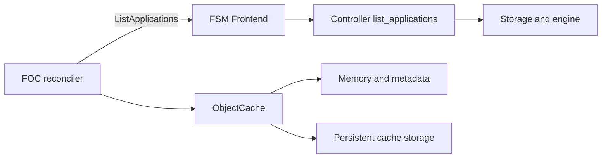

# Design: Cache-Owned Stale Application Data Cleanup

## 1. Motivation

### Background

RFE539 makes application removal asynchronous. The Flame Session Manager
(FSM) changes an application from `Enabled` to `Disabled`, rejects later
session admission, waits for open sessions to drain, and finally removes the
application metadata. It deliberately does not contact Flame Object Cache
(FOC).

Application packages and other application-scoped objects can therefore remain
in FOC. FOC owns its memory and persistent tiers, so it must also own cleanup
from both tiers. Calling FOC from FSM would couple application reconciliation
to cache availability and add remote I/O to FSM lifecycle paths.

FSM already exposes the application facts FOC needs through
`ListApplications`: application name, state, and creation time. This design
reuses that API. It does not introduce a metadata server, a new RPC, or new FSM
application attributes.

### Goals

1. Let each FOC replica remove stale application data from its own persistent
   and memory tiers.
2. Reuse the existing FSM frontend and `ListApplications` RPC unchanged.
3. Keep cache access and deletion out of FSM application, session, and task
   paths.
4. Retain all data while an application is `Disabled` and existing sessions
   may still need it.
5. Delete data belonging to a previous incarnation of a same-name application.
6. Delete orphaned data after its application metadata is gone.
7. Fail closed when FSM is unavailable or returns an invalid response.
8. Make cleanup idempotent, retryable, failure-isolated, and observable.
9. Preserve existing cache keys and `grpc://` and `grpcs://` URLs.

### Non-goals

- FSM does not delete cache objects or wait for FOC cleanup.
- FOC does not delete data held by HTTP, filesystem, or another external
  package store.
- This design does not remove executor-installed package copies.
- It does not add application lifecycle IDs, deletion tombstones, preparation
  APIs, or a watch protocol.
- It does not change protobuf messages or generated bindings.
- It does not provide a strict distributed transaction between package upload,
  application registration, and cache cleanup.

## 2. Function Specification

### Existing FSM contract

FOC calls the existing RPC with an empty filter:

```protobuf
rpc ListApplications(ListApplicationsRequest) returns (ApplicationList);
```

No request or response field is added. FOC builds an in-memory map keyed by
application name from the returned `Application` values and uses only:

- `metadata.name`;
- `status.state`; and
- `status.creation_time`.

The response is a vector of all current applications. The first implementation
does not add streaming or pagination. One reconciliation cycle normally makes
one list request and performs all object comparisons locally; it makes one
additional list request before deleting any candidates.

### Cache creation time

FOC needs the creation time of each cached object to distinguish data from an
older same-name application. Add `creation_time` to the stored `Object` and
copy it into FOC's in-memory `ObjectMetadata`; this is cache metadata, not an
FSM application attribute or public lifecycle API.

Creation time has these semantics:

- every successful full put, including `update_object`, records a new FOC
  wall-clock time;
- patch preserves the base object's existing creation time; and
- persistent storage retains the value and restores it on FOC restart.

Both opaque and native-Arrow disk formats encode the stored object's creation
time in their cache-format schema metadata. `StorageEngine::load_objects`
returns the restored `Object.creation_time`, and `load_from_storage` copies it
into `ObjectMetadata`. The `none` engine retains it only in memory, consistent
with that engine's non-persistent contract.

For an existing disk object without the field, FOC uses the file modification
time as a conservative migration value. A full update can make old data appear
newer and delay its deletion, but does not cause current data to be deleted.
Distinguishing replacement from update would require a wire change and is not
needed for safe cleanup.

### Stale-data rules

FOC evaluates objects by application name after a successful
`ListApplications` call. Let:

- `application_creation_time` be the FSM application's creation time;
- `object_creation_time` be the FOC object's creation time; and
- `stale_grace_period` cover package-upload-before-registration time and clock
  skew between FSM and FOC nodes.

The stale grace period is a fixed 10 seconds and is not configurable. Flame
accepts up to 10 seconds of relative clock skew for this cleanup decision.

| Application lookup | Object condition | Action |
| --- | --- | --- |
| `Enabled` | object predates application beyond grace | delete stale object |
| `Enabled` | object is within grace or newer | retain current object |
| `Disabled` | any | retain while sessions drain |
| missing | object is older than grace | delete orphaned object |
| missing | object is within grace | retain pending registration |
| invalid state or failed list | any | retain and retry |

For an enabled application, the exact stale comparison is:

```text
object_creation_time + stale_grace_period < application_creation_time
```

Data newer than the application is current data and is retained. If the same
application name is registered again, its newer application creation time
makes objects from the previous incarnation eligible for deletion while recent
package data uploaded just before registration remains inside the grace window.

For a missing application, FOC deletes only objects whose age exceeds the
grace period. This protects the normal package-upload-before-registration
window. A client that takes longer than the fixed grace period to register
can still race with cleanup; that is an accepted limitation of using only
name, state, and timestamps. A stronger guarantee would require a preparation
record or lifecycle identity, which is outside this design.

### Application scope and mixed generations

FOC evaluates and deletes exact objects, not an entire application prefix,
when an enabled application exists. This matters when an old and a new
same-name application have data in the cache simultaneously: old objects can
be removed without deleting recent package or session objects.

FOC also deletes exact objects when the application is missing. It does not use
an application-prefix fast path, so a recent object sharing the prefix cannot
be removed by an older classification snapshot.

The existing key format remains unchanged:

```text
<application_name>/<session_id>/<object_id>
```

Package objects under `<application_name>/pkg/` follow the same rules. FOC
does not parse or contact non-cache package URLs.

### Reconciliation loop

Each FOC replica owns its local memory and persistent storage and runs one
independent reconciler. No leader election is required for replica-local
volumes.

Each FOC process creates one long-lived tonic channel to the existing FSM
frontend endpoint and reuses it for every cycle. It does not create a
connection per application, object, or poll. Only one `ListApplications`
request is in flight per FOC process, including the optional recheck request.

The reconciler runs once after cache recovery completes and then at the
configured interval. The list RPC has a fixed five-second deadline. A failure
skips that cycle and is retried at the next interval.

One cycle performs the following steps:

1. Snapshot local `ObjectMetadata` and group it by application name.
2. Call `ListApplications` and validate that returned names are unique.
3. If the RPC fails or any returned application is invalid, delete nothing in
   this cycle. A partial response is not a safe basis for treating an
   application as missing.
4. For each local application scope, classify exact object keys using the
   stale-data rules.
5. If any candidate exists, call `ListApplications` once more and reclassify
   all candidates. This protects a newly disabled application and narrows, but
   does not make atomic, the registration race.
6. Acquire the candidate's existing per-key write lock and recheck its key,
   version, and creation time. A full put changes the version even if two
   wall-clock timestamps are equal, so a replacement is not deleted using an
   older decision.
7. Delete persistent data first. After success, remove matching memory objects
   and metadata and update eviction accounting. Keep the existing object-lock
   registry entry so a concurrent holder cannot diverge onto a second lock.
8. Continue other applications and objects when one deletion fails. The next
   cycle rediscovers and retries incomplete work.

Deletion is idempotent. An absent object or directory is success. If a disk
delete partially succeeds, remaining exact objects are retried. If persistent
deletion succeeds but memory cleanup is interrupted, the memory metadata keeps
the candidate discoverable and a later pass completes cleanup.

### Concurrency

Reconciliation reuses the existing per-key lock taken by put, patch, and get.
It holds that key's write lock across the metadata recheck and exact persistent
deletion. It never takes an application-wide lock or wildcard-deletes a mixed
scope, so cleanup of one object does not block unrelated objects in the same
application.

GC does not remove an entry from the key-lock registry while another operation
may retain its `Arc`; doing so could publish a second lock for the same key.
Lock-registry compaction is an independent cache-maintenance concern.

## 3. Implementation Detail

### Architecture



FSM and its protobuf API are unchanged. FOC adds an RPC client using the
existing generated `FrontendClient`, `cluster.endpoint`, and `cluster.tls`.
There is no new server, interface, listener, service port, deployment, or Helm
network path.

`object_cache::main` already loads the full `FlameClusterContext`; it passes
the cluster endpoint/TLS client settings together with `FlameCache` into
`cache::run` instead of adding a duplicate FOC-specific endpoint.

### FOC integration

Add an internal `ApplicationGarbageCollector` owned by `ObjectCache`. Cache
startup completes persistent recovery, spawns the collector task, and then
awaits the Flight server together with the background task. FSM unavailability
is non-fatal to cache startup and serving.

Extend `Object`, `ObjectMetadata`, and both persistent object encodings with
`creation_time`. Reuse `StorageEngine::delete_objects(&ObjectKey)` for exact
object deletion. The `none` storage deletion remains an idempotent no-op while
ObjectCache removes matching memory entries. Existing prefix deletion remains
available for explicit cache operations but is not used by GC.

### Configuration

FOC reuses existing cluster endpoint and TLS configuration. Garbage collection
is always enabled. The optional timing override is:

```yaml
cache:
  gc:
    interval: 60s
```

Omitting `cache.gc` or its `interval` uses the 60-second default. There is no
`enabled` flag or artifact-cleanup policy. `interval` is the only GC setting
and must be non-zero when specified. The five-second RPC deadline and 10-second
stale-data safety window are implementation constants. No additional endpoint
or certificate configuration is required.

### Failure handling

- If FSM is unavailable, the request times out, or list validation fails, FOC
  deletes nothing and retries later.
- An application with an unknown state, invalid creation time, missing
  metadata, or duplicate name invalidates the snapshot; FOC retains all
  candidates from that cycle.
- One object or application deletion failure does not stop other cleanup.
- FOC restart reloads persistent creation times and repeats decisions
  idempotently.
- FSM restart has no special recovery requirement beyond its existing
  application storage recovery.
- A concurrent full put changes the object's version; the under-lock recheck
  preserves the replacement.
- The fixed safety window must exceed upload-to-visible-registration latency,
  list-snapshot staleness, maximum relative FSM/FOC clock skew, and expected
  wall-clock adjustment. Larger clock jumps retain no strict safety guarantee.

### Observability

Every successful cycle emits one structured summary with candidate, deleted,
and failed object counts plus total cycle duration. A failed list or invalid
snapshot emits one warning and deletes nothing. Per-object debug or warning
events include the application name, exact key, stale reason when available,
and deletion error. These logs avoid adding application names as metric
labels.

## 4. Compatibility and Rollout

The change is additive to FOC and requires no FSM or SDK rollout. New FOC
starts reconciliation with a 60-second interval by default; operators may set
`cache.gc.interval` to another non-zero duration. Before rollout, verify that
the fixed safety window covers expected package-registration time and clock
behavior. Existing disk objects without a stored creation time use their
migration fallback immediately.

Old FOC continues serving normally. New FOC uses the existing FSM frontend and
cache key formats. Rolling back FOC stops reconciliation; no wire or storage
ownership contract must be rolled back.

## 5. Verification

### Unit and storage tests

1. Verify every full put, including update, assigns a new creation time, while
   patch preserves it.
2. Verify disk storage restores creation time and safely derives a migration
   time for legacy files.
3. Verify `Enabled` retains current/newer data and deletes only data predating
   the application beyond the grace period.
4. Verify `Disabled` retains all data regardless of age.
5. Verify a missing application retains recent pre-registration data and
   deletes data older than the grace period.
6. Verify mixed old and recent objects are evaluated and deleted individually.
7. Verify a full put racing with cleanup survives the under-lock version and
   creation-time recheck, including equal and backward-moving timestamps.
8. Verify persistent deletion failure leaves memory metadata and eviction
   accounting consistent for retry.
9. Verify per-key locking serializes full put, patch, get, and GC deletion for
   the same key without blocking unrelated keys.

### Reconciliation tests

1. Verify one `ListApplications` request is made normally and exactly one
   additional request is made when deletion candidates exist.
2. Verify timeout, unavailable FSM, duplicate application names, unknown state,
   and invalid creation time all fail closed.
3. Verify cleanup failure for application A does not prevent cleanup of B.
4. Verify retry after persistent success and interrupted memory cleanup is
   idempotent.
5. Verify two FOC replicas independently clean their own memory and volume.
6. Verify large local inventories are compared in memory without one RPC per
   application or object.

### End-to-end tests

1. Upload a package, make registration visible to `ListApplications` before it
   ages past the safety window, and verify cleanup does not remove the package.
2. Run an application and verify enabled and disabled phases retain its current
   package and session data.
3. Unregister and drain the application; after the grace period, verify FOC
   removes memory and persistent data.
4. Re-register the same name and verify objects from the old incarnation are
   removed while recent objects for the new application survive.
5. Stop FSM during reconciliation and verify FOC continues serving without
   deleting candidates.
6. Repeat with frontend TLS and unchanged `grpc://` and `grpcs://` cache URLs.

## 6. Alternatives Considered

### Dedicated metadata server or RPC

Rejected for now. `ListApplications` already returns the required application
name, state, and creation time. Another server, endpoint, listener, or RPC
would duplicate lifecycle access and add configuration and connections.

### Application lifecycle ID and deletion tombstone

Deferred. An immutable lifecycle ID gives a stronger ownership fence and a
durable tombstone distinguishes deletion from pre-registration with no timing
window. It also changes FSM storage, protobufs, SDK propagation, cache keys,
and rollout. The timestamp-and-grace design accepts a bounded registration race
to avoid that additional machinery.

### Delete every missing application immediately

Rejected. Package upload precedes application registration, so an immediate
delete can remove a valid package between upload and registration. The grace
period reduces this race without changing the API.

### Delete an entire same-name application prefix

Rejected when any recent object exists. Old and new application incarnations
can temporarily share a prefix. Per-object creation times allow stale objects
to be removed without deleting recent data.

### Stream application records

Rejected for the initial implementation. `ListApplications` already returns a
vector, and one response per FOC cycle avoids per-application RPCs. Pagination
or streaming can be added to the existing list API if measured application
counts make the vector response too large.
