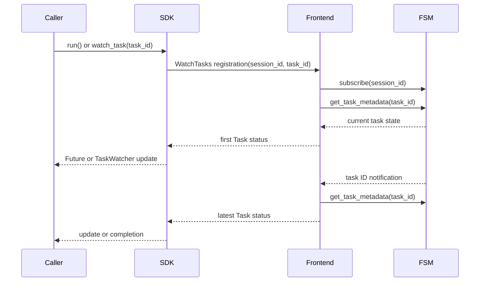

# Design: Session Task Watch Enhancement

Tracking issue: [#546](https://github.com/xflops/flame/issues/546).

## Status and scope

This document describes the implemented task watch enhancement. It replaces a
network watch per task with one bidirectional `WatchTasks` stream per active
session handle. The stream carries task ID registrations to the frontend and
task status updates back to the client. It supersedes the watch implementation
sections of
[RFE409](../RFE409-async-session-run/FS.md) and
[RFE418](../RFE418-notifier/FS.md), which describe earlier per-task watches.

The design covers the session manager (FSM), Rust SDK, and Python SDK. It does
not change task creation, scheduling, task storage, or the public `run()` and
`watch_task()` behavior. The wire API is `WatchTasks`, with a stream of
`WatchTaskRequest` messages and a stream of `Task` responses. Compatibility
with the former per-task watch RPC is not required. The canonical schema is
[frontend.proto](../../../rpc/protos/frontend.proto).

## Motivation

With one RPC per watched task, a session with many concurrent tasks also has
many gRPC streams, server tasks, and notification receivers. Those resources
grow with task count even though every watch needs updates from the same
session. The enhancement makes the network and FSM subscription count grow
with watched sessions instead. Each SDK still tracks individual task results
locally.

## Contract

1. The first request establishes a session watch and registers one task ID.
   An empty request stream is invalid. Every later request must name the same
   session; a duplicate task ID requests another current snapshot.
2. For each registration, the frontend sends its current status first. A task
   that is already terminal can complete the watch with that one response.
   The frontend then sends later statuses for registered tasks only.
3. Updates represent the latest state, not a complete transition log.
   Intermediate states may be coalesced at the server or by SDK consumers.
   Terminal updates include task event details, including failure messages.
4. A terminal task response removes that task ID from the server registration
   set and the SDK's local watch state. Closing the request side ends the RPC
   once every registered task has reached a terminal state.
5. Stream errors reach every remaining local waiter. Registration errors are
   returned to the caller. Closing a session closes its FSM notification
   channel; the frontend attempts final snapshots for registered tasks, then
   ends the stream with an error.

## FSM design

`TaskNotifier` holds one bounded Tokio broadcast sender per session and sends
task IDs rather than full task records. It creates a sender when the first
consumer subscribes, drops it when the last subscriber leaves, and removes it
when the session closes. The broadcast channel holds up to 1,024 task IDs.
The controller subscribes before checking that the session is open. This
ordering makes a concurrent close visible either as a failed subscription or
as channel closure to the established subscriber.

The frontend reads and validates the first request before returning the
response stream. It subscribes before fetching the first snapshot so an update
between subscription and snapshot remains observable. A set of registered task
IDs filters session notifications. On each matching notification, the frontend
fetches current task metadata and sends a status. For a terminal task, it
fetches the full task once to include its event history, then removes the ID
from the set. The response queue has capacity 128, which applies backpressure
to the frontend stream task.

If the broadcast receiver lags, the frontend refreshes every registered task
from storage. When the sender closes, it attempts the same refresh before
ending the stream. A dropped client response stops the server stream task.
This is a state watch: refresh can skip intermediate transitions but recovers
the latest state and terminal result when task storage remains available.

## SDK design

Both SDKs use the same logical watch manager for each session:

| Shared responsibility | Rust | Python |
| --- | --- | --- |
| One session stream | `WatchManager.stream` | `_SessionWatch._stream` |
| Registration requests | Bounded Tokio `mpsc` | `asyncio.Queue` |
| Task registry | `task_watcher` | `_SessionWatch._subscribers` |
| Latest status | Tokio `watch` value | Each watcher’s one-item queue |
| Local subscribers | Tokio `watch` receivers | `TaskWatcher` queues |

Both managers own registration, update delivery, terminal removal, stream
failure fan-out, close decisions, and the stream receive loop. The difference
is the local delivery primitive: Rust callers await Tokio `watch` receivers,
while Python's aio client delivers to task watchers and Futures on its event
loop. The synchronous Python facade runs that aio client on its `LoopThread`
and exposes blocking iterators and Futures.

### Rust

Each `Session` holds a `Connection` reference. The connection keeps strong
watch managers keyed by session ID, shared across its clones and independently
returned create, open, get, and list handles. It creates a manager only when a
watch starts, so listing sessions does not retain unused managers. The manager
lazily creates one `WatchTasks` stream and a bounded registration channel of
capacity 128.
`task_watcher` maps each registered task ID to a Tokio `watch` sender. A second
caller for the same task subscribes to that sender and sends another
registration; it waits for the frontend's fresh snapshot rather than replaying
the locally held value. The manager removes a
task's sender after delivering its terminal state. A stream failure drains
the map and sends the error to each remaining receiver. Informer callbacks
run outside the stream receive loop so user callback work does not stop the
stream from receiving other task updates.

The stream task holds an `Arc<WatchManager>`. `Session::close()` delegates to
`Connection::close_session()`. After the RPC succeeds, the connection removes
the manager from its map, aborts its stream, and errors remaining receivers.
A failed close leaves the manager active for a retry. Callers are expected to
retry close or exit the process after a failed close. Dropping a Session alone
is not a watch cleanup operation.

### Python

A core aio `Connection` owns the gRPC channel and at most one active
`_SessionWatch` per session ID. Each manager has one aio stream reader task,
an `asyncio.Queue` of task ID registrations and a subscriber set per task ID.
Each watcher sends a registration through the shared stream and receives a
fresh frontend snapshot, including later watchers of an existing task. Each
`TaskWatcher` keeps one unread update, so a slow consumer receives the latest state. Terminal updates
remove the task entry and reach its subscribers. Stream failure or connection
close reports an error to remaining subscribers.

Python can construct several `Session` objects for the same remote session
through create, open, get, or list calls. The connection's session-ID map makes
those objects share one watch manager and one stream. If each Python `Session`
solely owned a manager, two handles for the same ID could open two streams;
keeping a connection registry as well would duplicate the ownership state.
Rust also uses a connection-scoped registry so independently returned handles
share by remote session ID. Rust Session values hold their Connection, which
resolves the manager lazily when a watch begins.

The Python manager's reader task holds a strong reference to its manager
while it runs; `Connection` owns the shared gRPC channel and session-ID
registry. There is no weak upgrade or manager destructor cleanup path.
`Session.close()` closes the manager only after the close RPC succeeds and
errors remaining watchers. A failed close leaves the watch active for a retry;
`Connection.close()` cancels outstanding streams and errors waiters.

`TaskWatcher` stores only its next unread update. A caller can close an
abandoned iterator to unregister it. The sync facade dispatches user Future
callbacks on worker threads so slow callbacks do not block the aio watch
reader.

## Lifecycle and failure handling

| Event | FSM | SDK |
| --- | --- | --- |
| New registration | Send current status | Add task entry |
| Duplicate ID | Send a fresh snapshot | Reuse task entry; await snapshot |
| Task update | Read current status | Deliver latest status |
| Terminal update | Send events; remove ID | Complete and remove entry |
| Broadcast lag | Refresh registered IDs | Consume refreshed status |
| Session close | Refresh IDs; end stream | Error remaining waiters |
| Stream failure | Send error | Error remaining waiters |
| Client close | Drop response receiver | Cancel and error waiters |

Session close can remove task storage before the frontend's final refresh when
the storage session limit immediately evicts the closed session. In that case,
affected watchers receive an error instead of a terminal task snapshot. The
caller should avoid starting a new watch during session close and handle a
watch error from an active watch. The SDK does not cancel watches before the
close RPC, so a failed close call does not itself terminate them.

## Resource model

For a client watching `T` tasks in `S` sessions, the intended network and FSM
watch count is proportional to `S`, while local task entries remain
proportional to `T`. The Rust SDK registration queue and frontend response
queue are bounded at 128; the Python aio registration queue follows its
event loop's pending task count. FSM's task ID broadcast channel is bounded
at 1,024. A stalled stream can therefore block or delay new registrations, and
an overloaded broadcast receiver reconciles from stored task state instead
of growing its queue indefinitely.

There is no claim that every task transition is delivered, nor a measured
throughput target in this design. Performance validation should compare
stream count, FSM receiver count, memory, CPU, and completion latency at equal
task and session counts before and after the enhancement.

## Verification

The implementation has focused tests for first and duplicate registrations,
fresh snapshots, terminal events, registered-ID filtering, lag recovery,
closed and unknown sessions, response-drop cancellation, and session-close
delivery. SDK tests cover one stream per session, multiple watchers of one
task, Future completion, connection close,
and stream-error callbacks. The Python SDK guide and frontend API guide state
the first-status and coalescing contract.

Live-cluster performance and close-at-capacity behavior remain operational
validation items; they are not represented as passing benchmarks here.
