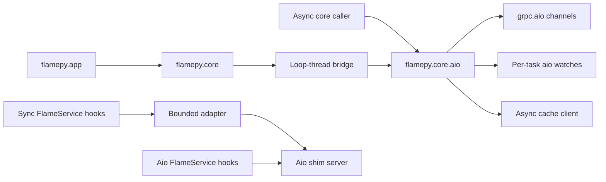

# Design: Aio Python SDK With Matching Synchronous APIs

**Status:** Draft
**Date:** 2026-09-26
**Issue:** [#547](https://github.com/xflops/flame/issues/547)

## 1. Motivation

`flamepy.core` currently uses synchronous gRPC for frontend and object-cache
calls. `Session.run()` submits a task and returns a
`concurrent.futures.Future`; a `WatchTask` stream for each task completes the
future from a worker thread. `flamepy.app` uses that client and synchronous cache
calls. Core users need native asyncio submission, watches, and cache I/O.
App users need remote `async def` functions and class methods while retaining
the existing synchronous App API.

The SDK will implement its transport and behavior in `flamepy.core.aio` and
expose a synchronous API in `flamepy.core` that calls that implementation.
The two core namespaces use the **same object and function names**, as `grpc`
and `grpc.aio` do. They have different calling styles and return types, but one
RPC, watch, cache, and shim-server implementation. Pure types, codecs, and
protobuf converters are shared directly.

This feature uses the existing frontend and object-cache RPCs. It requires no
server watch protocol change and can be implemented on its own branch.

## 2. Function Specification

### Namespaces and names

<!-- markdownlint-disable MD013 -->

| Synchronous | Aio | Behavior |
| --- | --- | --- |
| `flamepy.core.Connection` | `flamepy.core.aio.Connection` | Frontend client |
| `flamepy.core.Session` | `flamepy.core.aio.Session` | Session handle |
| `flamepy.core.TaskWatcher` | `flamepy.core.aio.TaskWatcher` | Task updates |
| `flamepy.core.FlameService` | `flamepy.core.aio.FlameService` | Service hooks |
| `flamepy.core.FlameInstanceServer` | `flamepy.core.aio.FlameInstanceServer` | Shim server |
| `flamepy.core.ObjectRef` | `flamepy.core.aio.ObjectRef` | Same shared type |

<!-- markdownlint-enable MD013 -->

`connect`, `create_session`, `open_session`, `get_session`, `list_sessions`,
`close_session`, application operations, `list_executors`, and `list_nodes`
keep their names. So do `Session.create_task`, `get_task`, `list_tasks`,
`watch_task`, `invoke`, `run`, and `close`. The aio `Connection` and `Session`
cover the complete current synchronous frontend API.

The cache functions `put_object`, `get_object`, `update_object`,
`patch_object`, `delete_objects`, `upload_object`, and `download_object` keep
their names under `flamepy.core.aio`. `ObjectRef`, `ObjectKey`, data classes,
error types, and options are the same Python objects in both namespaces.
`flamepy.app` and other upper layers keep synchronous public APIs. They use
`flamepy.core` for frontend and cache operations.

```python
# Synchronous
import flamepy.core as flame

connection = flame.connect("http://localhost:8080")
session = connection.create_session(attrs)
future = session.run(b"request")
result = future.result()
session.close()
connection.close()
```

```python
# Aio: same names, async I/O
import flamepy.core.aio as flame

async with await flame.connect("http://localhost:8080") as connection:
    session = await connection.create_session(attrs)
    future = await session.run(b"request")
    result = await future
    await session.close()
```

Synchronous `run` waits for task creation and schedules the watch, then
returns a `concurrent.futures.Future[bytes]`. Aio `run` awaits those two
operations and returns an `asyncio.Future[bytes]`; awaiting it waits for task
completion. `invoke` waits for output in both namespaces. `list_tasks` and
`watch_task` return blocking iterators in sync and async iterators in aio.
Both call the existing server-streaming `WatchTask` RPC for an individual
task. The stream delivers the current status and then later updates until
the task terminates or the stream fails.

The current module-level sync helpers keep their signatures and use the
synchronous facade. The aio module exposes `connect` and matching methods on
`Connection` and `Session`. Aio connections are explicitly owned by their
event loop; they are not stored in the process-wide sync
`ConnectionInstance`. Async module-level helpers that return a live session
without an explicit connection are outside the initial API.

### App and service functions

`flamepy.app` keeps its synchronous `init`, `destroy`, `service`, `get`,
`ref`, `wait`, and `select` APIs. Calling a decorated function still submits
a remote task and returns `ObjectFuture`. Calling a
decorated class still constructs its service proxy with the supplied
constructor arguments. The original Python function can be an `async def`;
the worker awaits it before returning a result.
App uses `flamepy.core`, which delegates its I/O to aio internally.

```python
import asyncio

import flamepy.app as app

app.init("example")

@app.service()
async def echo(value: str) -> str:
    await asyncio.sleep(0)
    return value

futures = [echo(str(i)) for i in range(3)]
values = [future.get() for future in futures]
app.destroy()
```

`ObjectFuture.get`, `ref`, and `wait` remain blocking, and `app.select`
remains a blocking iterator. The worker awaits a remote
`async def` service and returns its resolved value through the normal task
and cache protocol.
No `flamepy.app.aio` public API is proposed here.

`FlameService` keeps `on_session_enter`, `on_task_invoke`, and
`on_session_leave` names. `flamepy.core.aio.FlameService` subclasses define
async hooks. Existing `flamepy.core.FlameService` subclasses retain regular
synchronous hooks; an adapter invokes them from the aio shim server in a
bounded worker pool. `FlameInstanceServer` and `run` keep their names in both
modules. The sync server API is a blocking facade over the aio server. No
shim RPC or protobuf change is needed.

### Errors, cancellation, and scope

Both APIs use the same `FlameError` codes, timeout rules, and models.
Cancelling an aio future cancels its local result only: the remote task
continues because there is no task-cancel RPC. Its watch coroutine stops
and cancels its local `WatchTask` stream; a caller needing the final status
can start a new watch. Use `asyncio.shield(future)` to cancel one wait
without cancelling a shared future. Cancelling a watch iterator closes its
own stream and does not cancel the remote task.

This design covers frontend and cache clients and Python shim services. App
keeps its synchronous client API while supporting remote `async def` functions
and class methods. CPU-heavy work still requires worker threads or more
executors; aio does not make it nonblocking. The existing synchronous public
API remains compatible.

## 3. Implementation Detail

### Ownership and transport



The synchronous `Connection` owns one private event-loop thread. It creates
its aio `Connection` on that loop, submits coroutine calls with
`asyncio.run_coroutine_threadsafe()`, and waits for their results. It does
not create a `grpc.Channel` or a separate watch implementation.
`Connection.close()` closes the aio connection, then stops and joins its
loop thread. Calling a synchronous method from that same loop thread raises
a clear error instead of deadlocking. There is no `asyncio.run()` per method
and no nested-loop patch. Aio callers create their `Connection` on their own
running loop and use it only on that loop.

The aio `Connection` owns one `grpc.aio.Channel` and its frontend stub. Aio
`Session.watch_task()` opens the existing server-streaming `WatchTask` RPC
for one task. `Session.run()` creates a task and starts a coroutine to consume
that task's watch stream until completion or error, resolving a loop-owned
future. This removes the current worker-thread-per-task watch cost without
changing the number of server watch streams. The synchronous `TaskWatcher`
adapts an aio iterator through a bounded handoff, so slow sync readers
cannot block the aio event loop or grow an unbounded queue.

Sync `Session.run()` maps the aio result future to a
`concurrent.futures.Future`. The aio watch coroutine completes the result;
user callbacks run on a bounded callback executor, outside the aio loop.
The sync `list_tasks()` and `watch_task()` adapt aio iterators to blocking
iterators without blocking the aio loop. Connection close errors remaining
local subscribers and cancels streams. Session close follows the current
server contract; an unsuccessful close leaves the connection available for
retry.

Sync completions use a bounded callback handoff. When all callback slots are
occupied, the existing aio watch tasks wait before resolving their sync
futures; the aio loop remains free to process other RPCs. Connection close
resolves pending futures and drains their callbacks through a fixed number of
worker jobs. Explicit sync `Future.cancel()` invokes its callbacks on the
calling thread, matching `concurrent.futures.Future` behavior.

The aio cache client uses `grpc.aio` for all cache RPCs. The synchronous
cache functions call it through a lazily created loop-thread facade, rather
than using a second `grpc` transport. Object codecs, metadata validation,
compression choice, versioned local-cache rules, and `ObjectRef` format are
shared. CPU-heavy codec work and file reads/writes run in a bounded worker
pool so aio calls do not stall the event loop. Cache aio channels are
created and closed on their owning loop. The sync cache facade recreates its
loop and channels after a process fork.

Pure protobuf builders and proto-to-domain converters are shared by both
namespaces. RPC calls, watch state transitions, and cache protocol handling
exist only in aio code. Synchronous methods repeat public names but contain
only argument/return-value adaptation and loop-bridge calls.

### App execution and service lifetime

The App runtime uses the synchronous core and cache APIs, which delegate to
aio internally. App does not need another loop bridge or an aio public API.
Its service-definition validation, serialization, packaging, and
session-sharing rules stay in one implementation. `ObjectFuture.get()` blocks
for task completion and cache retrieval. It does not start an extra task
watch stream per result.

The aio core watch coroutine owns task completion. Its sync facade exports a
`concurrent.futures.Future` for App's `ObjectFuture`. App continues to use
`get()` for object retrieval and `select()` for blocking completion-order
iteration. It does not start an extra task watch per result.

The worker uses one `grpc.aio` shim server per executor. Its public
`flamepy.core.aio.FlameService` hooks are native coroutines. A sync
`flamepy.core.FlameService` is adapted by running its hooks in a bounded
executor with copied `ContextVar` state. The synchronous
`FlameInstanceServer.start()` blocks on the aio server's termination; its
`stop()` schedules aio shutdown. There is one shim RPC implementation and one
error/attribute mapping.
After the gRPC stop grace period, shim cleanup waits a bounded time for hooks
and cancels remaining async work. A running synchronous Python hook cannot be
interrupted; server stop does not wait indefinitely for its thread.

Flmrun is one aio `FlameService`. It awaits `async def` function services and
class methods before encoding and storing results with aio cache.
Synchronous user functions run in a bounded executor, with invocation
context copied into that worker thread. Constructors remain synchronous
Python constructors and also run outside the aio event loop. A synchronous
App client can call either kind of service and retrieves results with
`ObjectFuture.get()`.

A service instance belongs to an application/executor. Create it once for
that executor, retain it across session bindings, and destroy it only when
the executor is released. `OnSessionLeave` clears the active binding, not
the service instance. Its request has no session ID; one executor has one
active session binding at a time. Each concurrent task invocation gets its
own `ContextVar` state, including published attributes. Async methods on one
instance can interleave; user code protects shared mutable state when
needed. A bounded in-flight limit prevents unbounded coroutine growth.

### Lifecycle and verification

- Aio `connect` awaits channel readiness and closes on failure. The sync
  facade waits for it with the existing default timeout.
- Aio `run` awaits `CreateTask` and starts a `WatchTask` call before returning
  a future. The RPC's initial status covers completion before the watch
  begins. Cancellation during task creation may leave a server task
  whose ID the client never receives; this is a protocol limit.
- Aio connections reject use from another event loop. Sync connections are
  safe for multi-threaded callers under their current locking rules.
- Preserve the synchronous core, cache, App, and service tests; add aio
  parity tests for every `Connection` and `Session` method and cache RPC.
- Test one stream per watched task, current-status delivery, cancellation,
  stream failure, failed close, and connection close against a real gRPC
  endpoint.
- Test sync and `async def` App functions and class methods, sequential
  session bindings on one executor, and invocation-context isolation.
- Keep the existing `ObjectFuture.get()` and `app.select()` behavior tests;
  test remote `async def` results through `get()`.
- Benchmark sync and aio connection setup, task/cache throughput, thread
  count, RSS, and open watch-stream count at equal task and session counts.
  Compare the new sync path with the current implementation before rollout.

## 4. Use Cases

A synchronous program imports `flamepy.core` and keeps its method names and
blocking behavior. An asyncio program imports `flamepy.core.aio` and uses the
same core object and method names with `await` and `async for`. Both use the
same aio transport and watch implementation. `flamepy.app` stays synchronous,
and its result objects use blocking `get()` and `select()`. Its remote
services can be defined with `async def`.

## 5. References

- [Earlier async session proposal](../RFE409-async-session-run/FS.md)
- [Python SDK guide](../../sdk/python.md)
- [gRPC Python AsyncIO API](https://grpc.github.io/grpc/python/grpc_asyncio.html)
