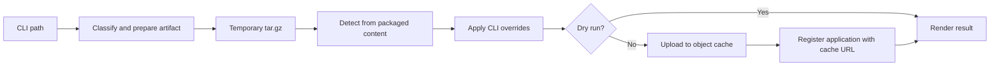

# Design: `flmctl deploy` Directory and File Packaging

Tracking issue: [#550](https://github.com/xflops/flame/issues/550).

## Status and scope

This document describes the current implementation. It extends
[RFE458](../RFE458-flmctl-deploy/FS.md), which defines the original
`flmctl deploy` command and registration flow. The input classification and
local archive naming in RFE458 predate this enhancement; the behavior below
supersedes those sections.

The enhancement accepts regular files, packages directories with project
ignore rules, reads directory application profiles, and names temporary
archives after their input. The uploaded
cache object remains content-addressed by application name and archive digest.
The same ignore-file names are also accepted by `flamepy.app.init()`; its
packaging contract is described separately below.

## 1. Motivation

### Background

The initial deploy command can package a directory, but it includes local
build products and other unwanted files unless users remove them from the
source tree first. It also assumes a standalone file is executable, so a
script such as `main.py` cannot be deployed directly. Its temporary archive
uses a generic name that does not identify the source input.

### Goals

1. Package a directory according to its own `.flmignore` and `.flameignore`
   files, using Gitignore-style patterns, negation, and nested rules.
2. Accept executable binaries, regular files, directories, and existing gzip
   tarballs through the same `--application` option.
3. Give the temporary archive a name derived from the input while preserving
   the content-addressed cache key.
4. Detect the runtime from the files the executor will actually receive.
5. Reuse the existing cache upload and application registration APIs.

This design adds no new manifest schema or server protocol. Ignore files are
project-local; ambient `.gitignore` and global Git exclusions do not control
`flmctl` archives.

## 2. Function Specification

### CLI contract

```bash
flmctl deploy --application <path> [--name <application-name>]
```

The current Flame context supplies the cache endpoint. It accepts `grpc://`,
`grpcs://`, `grpc+tls://` (normalized to `grpcs://`), and `grpcs-proxy://`.
The proxy scheme requires an explicit port; the other schemes default to 9090.
Credentials, paths, queries, and fragments are not accepted. Other options from
RFE458 remain available, including explicit `--command`, `--argument`,
`--installer`, `--dry-run`, and `-o summary|yaml|json`. Explicit installer and
command values override detection. A nonempty `--argument` list replaces
detected arguments.
The name can come from a directory profile; otherwise `--name` is required.

| Input | Temporary archive | Contents |
| --- | --- | --- |
| Directory `agent/` | `agent.tar.gz` | Files relative to `agent/` |
| Executable `worker` | `worker.tar.gz` | `bin/worker` |
| Python file `main.py` | `main.py.tar.gz` | Root `main.py` |
| Other file `data` | `data.tar.gz` | Root `data` |
| `bundle.tar.gz` | `bundle.tar.gz` | Repacked files |
| `bundle.tgz` | `bundle.tar.gz` | Repacked files |

A `.py` file is handled as a Python script even if its executable bit is set.
The `binary` installer for a standalone script extracts the archive and makes
its directory available to the command; it does not run a Python project
installation. For an ordinary file without a detected command, deploy fails
before upload and asks for `--command`.

Directories and existing tarballs detect a Python project or executable from
their contents. Executables use installer `binary` and their basename as the
command. Standalone `.py` files use installer `binary`, command `python3`,
and their basename as the argument. Other regular files use installer
`binary` and require an explicit command.

### Directory application profile

A directory may include `flame.yaml` or `flm.yaml` with one application
manifest in the existing `metadata`/`spec` format:

```yaml
metadata:
  name: worker
spec:
  installer: python
  command: python3
  arguments: [-m, worker]
  environments:
    FLAME_LOG_LEVEL: DEBUG
```

`flame.yaml` wins if both names exist. A malformed profile or one containing
multiple application manifests fails before upload. Explicit CLI values take
precedence over matching profile fields; profile fields take precedence over
detected defaults. Repeated `--argument` or `--label` options replace their
whole profile list when provided. `--env NAME=VALUE` overwrites the named
profile variable and retains other variables. Schema CLI fields override the
corresponding profile schema fields individually. The cache URL is always
generated from the new upload, even if the profile contains `spec.url`.

The directory profile is distinct from the client context at
`~/.flame/flame.yaml`. It configures the deployed application only; the
client context still supplies cluster and cache endpoints.

### Directory ignore rules

Only directory inputs use `.flmignore` and `.flameignore` during the `flmctl`
walk. Either file can appear at the root or in a nested directory. Patterns
use Gitignore syntax, including `!` negation. An ignored directory is not
traversed; as with Gitignore, a negated file inside it must have a traversable
parent. Where both names are present in one directory, `.flameignore` rules
take precedence over `.flmignore` rules. Ignore files themselves are ordinary
package files unless a rule excludes them.

`flmctl` disables the walker's standard filters and registers only these two
custom ignore names. Thus `.gitignore`, repository state, and user-global Git
rules do not silently change the package. No built-in file exclusions are
applied by `flmctl`; projects should list unwanted files in an ignore file.
Existing tarball inputs are unpacked and repackaged without applying these
ignore rules again.

For example, in `agent/.flmignore`:

```gitignore
*.log
!important.log
data/
```

### Detection and deploy result

For a directory, `flmctl` builds the archive first, extracts it into a
temporary detection directory, then detects the command and installer there.
This prevents an excluded `pyproject.toml` or executable from influencing the
registered spec. A tarball is similarly extracted for detection and
normalization. An archive with exactly one top-level directory uses that
directory as its detection root; otherwise it uses the extraction root.

A project containing `pyproject.toml`, `setup.py`, or `setup.cfg` selects the
`python` installer. Command detection prefers a `[project.scripts]` entry
matching the application name, then a sole script, then a module named after
the application with `__main__.py`. If no Python marker exists, detection
looks for an executable matching the application name under `bin/`, a sole
executable under `bin/`, or a sole executable at the root. If no unambiguous
command is found, the user must supply `--command`.

`--dry-run` still packages and detects locally, then prints the proposed
result without uploading or registering. Normal deployment uploads the archive
first, uses the endpoint and key returned by the cache to form `spec.url`,
and then calls the existing `register_application` API. Output supports
summary, YAML application spec, and JSON result forms.

### Local name and cache identity

The temporary archive name describes the source input. It is not the cache
object name. After packaging, `flmctl` computes the SHA-256 digest of the
archive and proposes this cache key for every input kind:

```text
<application-name>/pkg/<application-name>-<first-16-sha256-hex>.tar.gz
```

The registered URL uses the cache server's advertised endpoint and the key
returned by the upload. This allows a CLI upload through an external proxy
while executors download from the internal cache endpoint. Dry-run output uses
the normalized context endpoint because no upload response is available.
Changing archive bytes changes the proposed object key without changing the
application name. The temporary archive and extracted detection tree are
removed when the deploy plan is dropped.

### Interaction with `flamepy.app.init()`

The Python App SDK also reads `.flmignore` and `.flameignore`, including nested
patterns and negation, when it packages the current project. The SDK retains
its built-in exclusions for environments, caches, and other generated files.
Its package still uses its own App naming and storage flow. User package
exclusions have moved out of `flame.yaml`: `package.storage` remains, while
`package.excludes` is no longer parsed or emitted by current configuration.

## 3. Implementation Detail

### Components and data flow



- `flmctl/src/deploy/artifact.rs` classifies inputs, walks directories,
  normalizes archives, computes the digest, and retains temporary files in
  `PreparedApplication` until deployment finishes.
- `flmctl/src/deploy/detect.rs` selects installer, command, and arguments.
- `flmctl/src/deploy.rs` validates options, applies overrides, uploads the
  archive, registers the application, and renders output.
- `sdk/python/src/flamepy/app/client.py` implements the related App SDK
  project packaging behavior using `pathspec`.

The directory walker collects file paths and sorts them before writing. The
tarball has no directory entries. Gzip and tar modification times, and tar
user/group IDs, are set to zero; file permission bits are retained. This
makes a package stable when its included files and modes stay the same.

### Safety and failure behavior

Inputs are resolved before packaging. Directory symlinks to files inside the
project are archived as regular files; symlinks outside the project and
symlinked directories are rejected. Existing tarball inputs accept regular
files and directories only, reject unsafe paths, and are repacked from a
temporary extraction tree. Packaging, invalid configuration, and unresolved
runtime detection fail before cache upload.

Upload and registration are sequential, not atomic. A successful upload
followed by failed registration can leave an unreferenced cache object; the
cache's application-data cleanup design is documented in
[RFE540](../RFE540-cache-owned-application-garbage-collection/FS.md).

The implementation reads the whole directory once to build the archive and
extracts that archive again for detection. The archive, extracted files, and
source may coexist temporarily on local disk. No archive size limit is added
by this enhancement.

## 4. Use Cases

### Python project with generated files

Put `__pycache__/`, `dist/`, or local datasets in `project/.flmignore`, then
run `flmctl deploy --name project --application ./project`. The archive omits
those paths. Detection uses the remaining Python project metadata, then the
package is uploaded and registered.

### Standalone script

Run `flmctl deploy --name script-app --application ./main.py`. The archive
contains `main.py` at its root; the generated spec uses installer `binary`,
command `python3`, and argument `main.py`.

### Executable and existing tarball

An executable `worker` becomes `worker.tar.gz` with `bin/worker` inside.
An existing `bundle.tgz` is safely extracted and repacked as a temporary
`bundle.tar.gz`. Both use an application-name-and-digest cache object key.

### E2E Python service package

The E2E project has a `flame.yaml` profile with installer `python` and command
`python3 -m e2e.basic_svc`. Each test fixture deploys that directory with an
application-name override. The executor installs the uploaded package and
imports the service module from it, so the executor does not need the E2E
source directory mounted at `/opt/e2e`.

## 5. Verification and references

`flmctl/src/deploy/artifact.rs` tests archive layout, source-based naming,
ignore patterns and negation, detection-root filtering, and unsafe tar paths.
`flmctl/tests/deploy_cli.rs` covers dry-run behavior for directory, executable,
and standalone Python-file inputs. The Python SDK package tests inspect
ignore-filtered App archives. The current CLI tests do not exercise a live
cache upload or application registration.

Related documents: [RFE458](../RFE458-flmctl-deploy/FS.md) for the base deploy
contract, [RFE540](../RFE540-cache-owned-application-garbage-collection/FS.md)
for cache cleanup, and [App setup](../../tutorials/app-setup.md) for project
packaging guidance.
